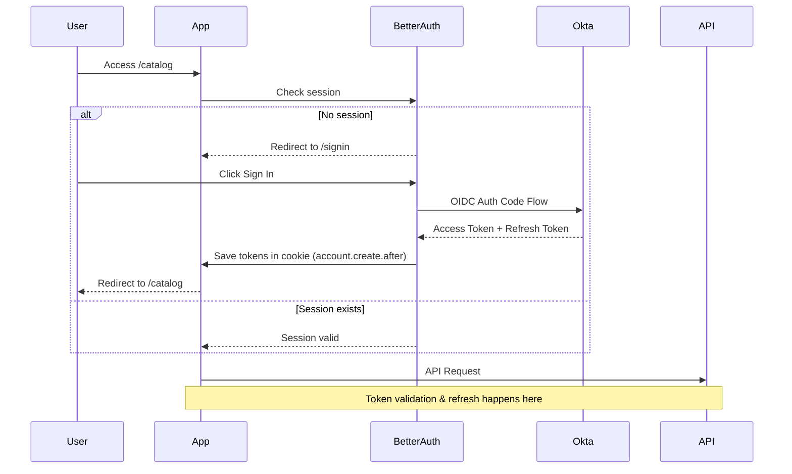
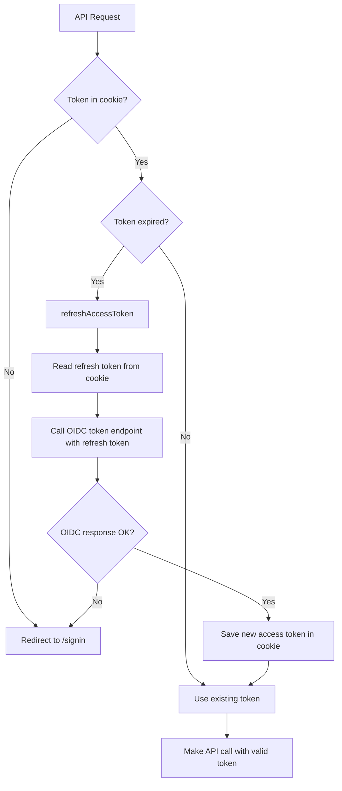

# Authentication & Token Management

This folder contains the OIDC authentication logic with automatic access token refresh using Better Auth.

## Architecture

**Key Components:**

- **Better Auth**: Handles OIDC flow and session management
- **Custom Token Storage**: Encrypted HTTP-only cookies for OIDC tokens
- **Automatic Refresh**: Transparent token refresh when expired

## Authentication Flow



## Token Refresh Flow



## Key Files

### Core Authentication

- **`auth.ts`** - Better Auth configuration with genericOAuth plugin
- **`utils.ts`** - User info extraction from OIDC tokens (Azure AD compatible)
- **`token.ts`** - Token retrieval and refresh orchestration
- **`constants.ts`** - Token lifetimes and configuration

### Token Storage

- **`cookie.ts`** - Encrypted HTTP-only cookie storage (stateless mode)
- **`db.ts`** - PostgreSQL database storage (when DATABASE_URL is set)
- **`crypto.ts`** - AES-256-GCM encryption for cookie tokens

### Client-side

- **`auth-client.ts`** - Client-side auth utilities
- **`actions.ts`** - Server actions for auth operations

## Token Lifetimes examples

| Token          | Lifetime       | Storage                      | Managed By  |
| -------------- | -------------- | ---------------------------- | ----------- |
| Access Token   | 5 min (Okta)   | HTTP-only cookie (encrypted) | Custom      |
| Refresh Token  | 30 days (Okta) | HTTP-only cookie (encrypted) | Custom      |
| Session Cookie | 7 days         | HTTP-only cookie             | Better Auth |

## How It Works

### 1. Initial Login

When a user signs in via OIDC:

1. Better Auth redirects to Okta
2. Okta returns access token + refresh token
3. `account.create.after` hook saves tokens in encrypted cookie
4. Session established for 7 days

### 2. Re-Login (after signout)

When a user signs in again:

1. Better Auth updates the account
2. `account.update.after` hook saves new tokens in encrypted cookie
3. Session refreshed for another 7 days

### 3. API Requests

When making an API call:

1. `getValidOidcToken()` retrieves token from cookie
2. If expired, calls `refreshAccessToken()` server-side
3. Uses refresh token to get new access token from OIDC provider
4. New token saved in cookie and returned
5. API request proceeds with valid token

### 4. Token Expiration

- **Access token expires** → Automatic refresh using refresh token
- **Refresh token expires** → User must re-authenticate
- **Session expires** → User must re-authenticate

## Environment Variables

```bash
# OIDC Configuration
OIDC_ISSUER_URL=https://your-okta-domain.okta.com
OIDC_CLIENT_ID=your-client-id
OIDC_CLIENT_SECRET=your-client-secret
OIDC_PROVIDER_ID=okta

# Better Auth
BETTER_AUTH_URL=http://localhost:3000
BETTER_AUTH_SECRET=your-secret-key

# API
API_BASE_URL=http://localhost:9090
```

## Security Features

- ✅ HTTP-only cookies (not accessible via JavaScript)
- ✅ Encrypted token storage (AES-256-GCM)
- ✅ Secure flag in production
- ✅ SameSite protection
- ✅ Automatic token rotation
- ✅ Server-side only API client
